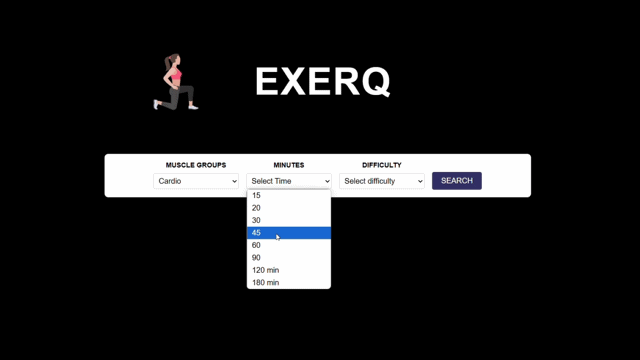
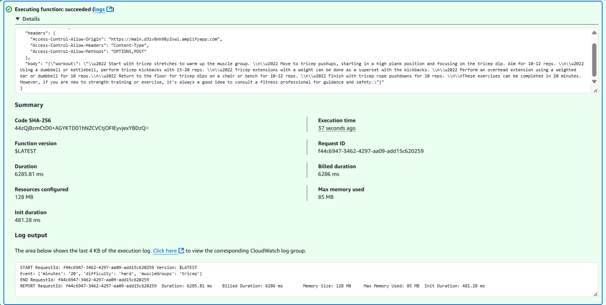
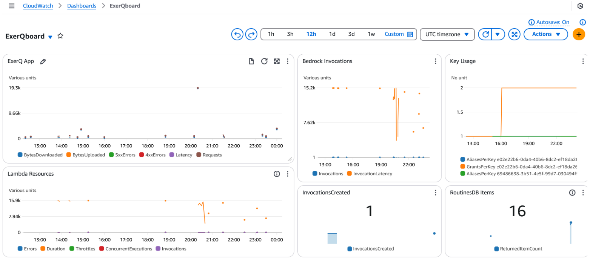
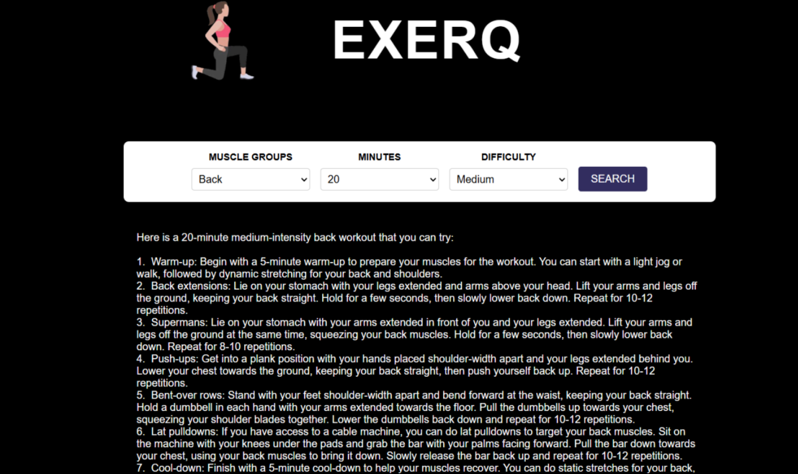

> Check out the project here: [ExerQ](https://main.d3iv8nh98y2vwl.amplifyapp.com/)

## Abtract
This project delivers a responsive workout routine tool using DevOps and CI/CD pipelines for efficient, scalable deployment. It provides real-time, personalized workout recommendations based on user preferences like duration, difficulty, equipment, and fitness goals.

Automated pipelines ensure fast updates to the frontend and backend, while cloud deployment supports high availability. A dynamic exercise database and user accounts enable tailored routines and saved favorites.

By applying modern DevOps practices, the project streamlines development and ensures a smooth, user-friendly experience.



## Tool Analysis
We used GitHub Automation to manage deployment and build our CI/CD pipelines. It worked well overall, though we encountered one issue where a deployment appeared successful on GitHub but triggered an error in AWS Amplify. With some team troubleshooting, we resolved it quickly.

AWS’s wide range of services was a major asset during development, offering flexibility and convenience. However, this also added complexity, as getting familiar with the platform took time.

Choosing the right AI model was critical, since our website’s content is entirely generated by it. We selected a Cohere model, available through AWS, which simplified setup and was well-suited for our prompt-based use case.

**Final Tool Selection**
- HTML5: to define the page structure and UI elements
- CSS3: to enable visual design, layout, and responsive behavior
- JavaScript: to enable user interaction and input validation
- GitHub: to store and manage our codebase
- Git: to enable version control
- GitHub Actions: to enable CI/CD workflows
- AWS: to deploy our web application

## Amazon Web Service (AWS)
### Identity and Access Management (IAM)
For our team project, only three of us needed explicit access to AWS, following the principle of least privilege, we distributed what was necessary to complete a specific task. I was responsible for the AWS infrastructure so I had admin access to all the services necessary for the project: Lambda, DynamoDB, API Gateway, Amplify, and Bedrock. Other team members were given read access for demonstration recording and write access to Lambda for assistance with writing the function.

We also utilized a role that would allow each of these services to communicate with each other: `LambdaRoutines`.

### Amplify
AWS Amplify is a cloud-based service provided by Amazon Web Services that allows developers to easily build, deploy, and host full-stack web and mobile applications. It provides frontend hosting, backend support (like APIs and authentication), and smooth integration with GitHub for automated deployments.

### Bedrock
Amazon Bedrock is a fully managed service that allows us to build and scale generative AI applications using foundation models via an API, without needing to manage infrastructure. It supports models from providers like AI21 Labs, Anthropic, Cohere, Meta, Stability AI, and Amazon's own Titan models. We requested access to on-demand Cohere AI models which are designed for enterprise-level natural language processing tasks such as text classification and summarization with a focus on fast, secure, and customizable language model deployment.

### Lambda
Next, we created our Lambda function that our script.js will call when someone clicks the search button. AWS Lambda is a serverless compute service that lets us run code in response to events (like API calls or file uploads) without managing servers. We uploaded our lamba_function.py code, and Lambda automatically handles the rest.

Essentially, when we do a certain act on the web application, we set up an Invoke API call to API Gateway which sends the user input to Lambda. From there it calls our Cohere Bedrock model and send that information back to the web app to be displayed for the user.

```python
import boto3
import json
from time import gmtime, strftime

def lambda_handler(event, context):
    bedrock = boto3.client(
        service_name='bedrock-runtime',
        region_name='us-east-1', 
    )
    dynamodb = boto3.resource("dynamodb", region_name='us-east-1')
    table = dynamodb.Table("Routines")

    try:
        print(f"Event: {event}")
        duration = str(event.get("minutes", ""))
        difficulty = str(event.get("difficulty", ""))
        focus = str(event.get("muscleGroups", ""))

        if not duration or not difficulty or not focus:
            return {
                "statusCode": 400,
                "body": json.dumps({"error": "Missing input data"})
            }

        # Construct the prompt
        user_prompt = (
            f"Create a {duration}-minute {difficulty} workout routine focusing on {focus}. "
        )
        
        cohere_body = {
            "prompt": user_prompt,
            "max_tokens": 500,
            "temperature": 0.7
        }
        
        response = bedrock.invoke_model(
            modelId="cohere.command-text-v14",
            body=json.dumps(cohere_body),
            contentType="application/json",
            accept="application/json"
        )

        # Read response
        result = json.loads(response["body"].read())
        workout = result["generations"][0]["text"].strip()

        # Store in DynamoDB
        now = strftime("%a, %d %b %Y %H:%M:%S +0000", gmtime())
        routine_id = f"{difficulty}-{duration}min-{focus}"

        table.put_item(Item={
            "ID": routine_id,
            "GeneratedAt": now,
            "Prompt": user_prompt,
            "Workout": workout
        })

        return {
            "statusCode": 200,
            "headers": {
                "Access-Control-Allow-Origin": "https://main.d3iv8nh98y2vwl.amplifyapp.com",
                "Access-Control-Allow-Headers": "Content-Type",
                "Access-Control-Allow-Methods": "OPTIONS,POST"
            },
            "body": json.dumps({"workout": workout})
        }

    except Exception as e:
        print(f"Error: {e}")
        return {
            "statusCode": 500,
            "headers": {
                "Access-Control-Allow-Origin": "https://main.d3iv8nh98y2vwl.amplifyapp.com",
                "Access-Control-Allow-Headers": "Content-Type",
                "Access-Control-Allow-Methods": "OPTIONS,POST"
            },
            "body": json.dumps({"error": str(e)})
        }

```

The great thing about lambda was that, we were able to test our function within the service:


### DynamoDB
Amazon DynamoDB is a fully managed NoSQL database that stores data flexibly and at scale. Its schema-less structure was ideal for testing our data setup. We created a "Routines" table using the UI, with the partition key set to ID.

An example data entry would be as follows:
- ID: extra-hard-15 minmin-Glutes
- Time: Wed, 30 Apr 2025 23:09:33 +0000
- Prompt: Create a 15 min-minute extra hard workout routine focusing on Glutes. This should be in bullet points. Less description.
- Workout: Certainly! Below is a 15-minute extra-hard glute workout with minimal descriptions: Glute Bridge - 3 sets of 10 reps, Single-Leg Deadlift - 3 sets of 8 rep

### API Gateway
AWS API Gateway connects the web app to Lambda, handling HTTP requests (like POST) and managing routing, validation, and authorization. This allows secure, serverless interaction between the frontend and backend.

We created a POST API to trigger the Lambda function, using the OPTIONS method to set necessary headers. CORS was enabled to allow secure cross-domain communication between the frontend and AWS services.

### CloudWatch
Dashboards are key in DevSecOps for real-time visibility into system health, security, and performance. We used Amazon CloudWatch to track logs, metrics, and alarms, helping us detect issues quickly.



Our dashboard monitors Lambda requests, latency, errors, database item counts, and key usage to ensure everything runs securely and efficiently.

## DevSecOps Principles Utilized
- Continuous Integration and Continuous Delivery (CI/CD)
- Automation
- Collaboration
- Version Control
- Monitoring & Traceability
- Scalability
- End-to-End Responsibility
- Identity Management

## Conclusion
We built the ExerQ web app using key DevSecOps principles, managing CI/CD with GitHub Actions and AWS Amplify for seamless deployment. Version control tools supported collaboration across features.

To ensure scalability, we set usage alerts and planned for increasing AI invocation limits. User privacy was prioritized—data is tracked anonymously, and team access was limited with strict permissions.

We leveraged AWS services like Amplify, Lambda, Bedrock, CloudWatch, and DynamoDB to enhance performance and track analytics. This project reinforced the value of strong infrastructure and team collaboration.



:::note[Reflection]
This was my first AWS project ever, I was a complete beginner. Though I accomplished a lot even with no experience, this was the catalyst to my interest in the cloud.
Some things that I would have liked to do with more time:
- Clean up the UI
- Add optional user inputs such as equipment or style of exercises (pilates, calisthenics, powerlifting, etc.)
- Add a page for users to explore previously generated routines which would use our DynamoDB database to maintain
- Use infrastructure as code (IaC) to build and maintain the web app
:::