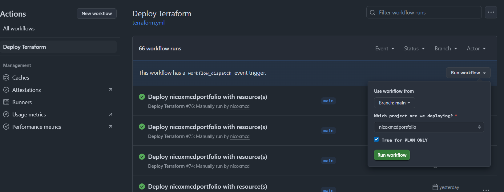

> You're experiencing this project right now: [Home](https://nicoxmcd.com)

:::note
Instead of creating the project through the console, then converting it to use IaC later on, I started with creating the infrastructure through Terraform.
:::


## Frontend
For the frontend I decided to go with [Astro](https://docs.astro.build/en/concepts/islands/), and I ended up using this [template](https://github.com/saicaca/fuwari). It was by far, the most intuitive one that I could find. 

I also decided to go with Astro so that I could gain exposure to a new tool, and it is very interesting. Astro uses Islands architecture, so instead of rendering the entire website with Javascript, you render some select components, making the user experience smoother and more seamless. 

I also decided not to re-invent the wheel, which is why I went with a pre-made template. I wanted my project to focus more on DevOps rather than focusing on the many intricate choices for the frontend.

Some changes I made to the website was adding more pages which involved creating new astro source files that utilize the prebuilt layouts and components. By doing so, I also had to update multiple config.ts files to allow the navigation bar to navigate between the extra files. 

Some thing I plan to add is adding a language option. I currently have English, Spanish, Korean, and German as my four language options in the source files, but I need to create functions and UI to allow the user to pick. 


## Infrastructure as Code
I chose to go with **Terraform** instead of CloudFormation for a couple of different reasons:
- Terraform is cloud-agnostic, so if I wanted to deploy this project on Azure or GCP then I could add them as a provider and make some adjustments following Terraform's documentation.
- Although I know AWS the best, I don't want to be siloed, I want my skills to be transferrable to any cloud provider.
- HashiCorp Configuration Language (HCL) is very readable and more intuitive.
- There is also the ability to preview changes through Terraform Plan which I added as an option to my automation.
- Terraform is industry relevant and provides flexibility

The learning curve was a bit difficult, I went with no experience in Terraform, but by the end I was able to debug and adjust as necessary. 

---
I keep my IaC in my Cloud repository:
::github{repo="nicoxmcd/cloud"}

`backend.tf` basically supplies terraform with information to access the state file. That way I don't have to import each resource individually and it also prevents duplication and other potential issues (all of which I've run into)!
```hcl
terraform {
  backend "s3" {
    bucket         = "nicoxmcdportfolio-tfstate"
    key            = "terraform.tfstate"
    region         = "us-east-1"
    dynamodb_table = "terraform-locks"
    encrypt        = true
  }
}
```

`terraform.tfvars` sets up the project's input variable values: `domain_name` and `bucket_name` that way I can reuse this across environments.
```hcl
domain_name = "nicoxmcd.com"
bucket_name = "nicoxmcdportfolio"
```

`variables.tf` defines input variables for the `domain_name`, `bucket_name`, and `region`, while also providing descriptions and default values to make the configuration a bit more flexible.
```hcl
variable "domain_name" {
  type = string
  description = "Name of the domain"
}
variable "bucket_name" {
  type = string
  description = "Name of the bucket."
}
variable "region" {
    type = string
    default = "us-east-1"
}
```

`provider.tf` specifies the required Terraform provider (AWS) and configures it to use `us-east-1` region.
```hcl
terraform {
  required_providers {
    aws = {
      source = "hashicorp/aws"
      version = "6.0.0"
    }
  }
}

provider "aws" {
  region = "us-east-1"
}
```

`s3.tf` creates an S3 bucket to host nicoxmcdportfolio and configures it as a static website, defining the `index_document` and `error_document`.
```hcl
resource "aws_s3_bucket" "portfolio" {
  bucket = "${var.bucket_name}"
  tags = {
    Project = var.domain_name
  }
}

resource "aws_s3_bucket_website_configuration" "website_config" {
  bucket = aws_s3_bucket.portfolio.bucket

  index_document {
    suffix = "index.html"
  }

  error_document {
    key = "404.html"
  }
}
```

`versioning.tf` enables versioning on the S3 bucket and sets up a lifecycle rule to delete noncurrent versions after 30 days, which improves data durability and cost efficiency.
```hcl
resource "aws_s3_bucket_versioning" "versioning" {
  bucket = aws_s3_bucket.portfolio.id

  versioning_configuration {
    status = "Enabled"
  }
}

resource "aws_s3_bucket_lifecycle_configuration" "versioning_lifecycle" {
  bucket = aws_s3_bucket.portfolio.id
  
  rule {
    id     = "expire-noncurrent-versions"
    status = "Enabled"

    filter {}

    noncurrent_version_expiration {
      noncurrent_days = 30
    }
  }
}
```

`policy.tf` configures the S3 bucket to allow public read access, enables cross-origin requests (CORS), sets ownership controls, and adjusts public access settings to allow website hosting.
```hcl
resource "aws_s3_bucket_policy" "bucket_policy" {
  bucket = aws_s3_bucket.portfolio.bucket

  policy = jsonencode({
    Version = "2012-10-17",
    Statement = [
      {
        Sid       = "AllowPublicRead",
        Effect    = "Allow",
        Principal = "*",
        Action    = "s3:GetObject",
        Resource  = [
          "${aws_s3_bucket.portfolio.arn}",
          "${aws_s3_bucket.portfolio.arn}/*"
          ]
      }
    ]
  })
  depends_on = [ aws_s3_bucket_public_access_block.public_access ]
}

resource "aws_s3_bucket_ownership_controls" "ownership" {
  bucket = aws_s3_bucket.portfolio.bucket

  rule {
    object_ownership = "BucketOwnerPreferred"
  }
  depends_on = [aws_s3_bucket_public_access_block.public_access]
}

resource "aws_s3_bucket_acl" "acl" {
  bucket = aws_s3_bucket.portfolio.bucket
  acl    = "public-read"
  depends_on = [aws_s3_bucket_ownership_controls.ownership]
}

resource "aws_s3_bucket_public_access_block" "public_access" {
  bucket = aws_s3_bucket.portfolio.bucket

  block_public_acls       = false
  block_public_policy     = false
  ignore_public_acls      = false
  restrict_public_buckets = false
}

resource "aws_s3_bucket_cors_configuration" "cors" {
  bucket = aws_s3_bucket.portfolio.bucket
  cors_rule {
    allowed_headers = ["Authorization", "Content-Length"]
    allowed_methods = ["GET", "POST"]
    allowed_origins = ["https://${var.domain_name}","https://www.${var.domain_name}"]
    max_age_seconds = 3000
  }
}
```

`route53.tf` creates a Route 53 hosted zone for the domain and sets up DNS records to route both the root domain and `www` subdomain to the CloudFront distribution.
```hcl
resource "aws_route53_zone" "main" {
  name = var.domain_name

  tags = {
    Project = var.domain_name
  }
}

# Alias using DNS records pointing to CloudFront not directly to S3
# Direct www.nicoxmcd.com to www.nicoxmcd.com
resource "aws_route53_record" "www_a" {
  zone_id = aws_route53_zone.main.zone_id
  name    = "www.${var.domain_name}"
  type    = "A"

  alias {
    name    = aws_cloudfront_distribution.cdn.domain_name
    zone_id = aws_cloudfront_distribution.cdn.hosted_zone_id
    evaluate_target_health = false
  }
}

# Redirect apex (nicoxmcd.com) to www.nicoxmcd.com
resource "aws_route53_record" "apex_redirect" {
  zone_id = aws_route53_zone.main.zone_id
  name    = var.domain_name
  type    = "A"

  alias {
    name                   = aws_cloudfront_distribution.cdn.domain_name
    zone_id                = aws_cloudfront_distribution.cdn.hosted_zone_id
    evaluate_target_health = false
  }
}
```

`cloudfront.tf` creates a CloudFront distribution that cahces and serves the S3-hosted site over HTTPS, using a custom domain and an ACM SSL certificate with error handling and optimization settings.
```hcl
resource "aws_cloudfront_distribution" "cdn" {
  origin {
    domain_name = aws_s3_bucket_website_configuration.website_config.website_endpoint
    origin_id   = "S3-${aws_s3_bucket.portfolio.bucket}"

    custom_origin_config {
      http_port              = 80
      https_port             = 443
      origin_protocol_policy = "http-only" # required for S3 static website hosting
      origin_ssl_protocols   = ["TLSv1", "TLSv1.1", "TLSv1.2"]
    }
  }

  enabled             = true
  is_ipv6_enabled     = true
  comment             = "CloudFront distribution for ${aws_s3_bucket.portfolio.bucket}"
  default_root_object = "index.html"

  aliases = [ "${var.domain_name}","www.${var.domain_name}" ]

  custom_error_response {
    error_caching_min_ttl = 0
    error_code            = 404
    response_code         = 200
    response_page_path    = "/404.html"
  }

  default_cache_behavior {
    allowed_methods        = ["GET", "HEAD", "OPTIONS"]
    cached_methods         = ["GET", "HEAD"]
    target_origin_id       = "S3-${aws_s3_bucket.portfolio.bucket}"
    viewer_protocol_policy = "redirect-to-https"

    forwarded_values {
      query_string = false
      cookies {
        forward = "none"
      }
    }
    min_ttl                = 31536000
    default_ttl            = 31536000
    max_ttl                = 31536000
  }

  price_class = "PriceClass_100"

  restrictions {
    geo_restriction {
      restriction_type = "none"
    }
  }

  viewer_certificate {
    acm_certificate_arn      = aws_acm_certificate_validation.cert_validation.certificate_arn
    ssl_support_method       = "sni-only"
    minimum_protocol_version = "TLSv1.2_2021"
  }

  tags = {
    Project = var.domain_name
  }
}
```

`certificate.tf` requests an ACM SSL certificate for the domain and its `www` subdomain, using DNS validation to prove domain ownership.
```hcl
resource "aws_acm_certificate" "cert" {
  domain_name       = "${var.domain_name}"
  subject_alternative_names = ["www.${var.domain_name}"]
  validation_method = "DNS"

  tags = {
    Project = var.domain_name
  }

  lifecycle {
    create_before_destroy = true
  }
}
```

`validation.tf` creates DNS records in Route53 to validate the ACM certificate via DNS, and completes the certificate validation process needed for CloudFront to serve HTTPS traffic.
```hcl
resource "aws_route53_record" "cert_validation" {
  allow_overwrite = true
  name    = tolist(aws_acm_certificate.cert.domain_validation_options)[0].resource_record_name
  type    = tolist(aws_acm_certificate.cert.domain_validation_options)[0].resource_record_type
  records = [tolist(aws_acm_certificate.cert.domain_validation_options)[0].resource_record_value]
  zone_id = aws_route53_zone.main.zone_id
  ttl     = 300
}

resource "aws_route53_record" "cert_validation_www" {
  allow_overwrite = true
  name            = tolist(aws_acm_certificate.cert.domain_validation_options)[1].resource_record_name
  type            = tolist(aws_acm_certificate.cert.domain_validation_options)[1].resource_record_type
  records         = [tolist(aws_acm_certificate.cert.domain_validation_options)[1].resource_record_value]
  zone_id         = aws_route53_zone.main.zone_id
  ttl             = 300
}

resource "aws_acm_certificate_validation" "cert_validation" {
  certificate_arn         = aws_acm_certificate.cert.arn
  validation_record_fqdns = [
    aws_route53_record.cert_validation.fqdn,
    aws_route53_record.cert_validation_www.fqdn
  ]
}
```


## Automation and CI/CD
The first issues I had when deploying the infrastructure was originally not maintaining a state file or importing the resources. Terraform would recreate each resource every time you ran the workflow. It was resolved by importing the specific resources, that way Terraform would recognize that those resources do not need to be created, just updated. I went back and implemented a state file by manually creating a new S3 bucket `nicoxmcdportfolio-tfstate` and a DynamoDB table for locking `terraform-locks`.


### Frontend
The frontend is deployed directly from its repository upon any changes made to the `main` branch.
`deploy.yml` configures OpenID Connection (OIDC) to AWS which allows the repository to update resources in AWS using a predefined role. The role in AWS only allows these requests from the `main` branches of `nicoxmcd/nicoxmcdportfolio` and `nicoxmcd/Cloud`. I run a check for Astro to ensure that Astro is configured correctly, if so, it then builds the project, which creates a `/dist` folder with all of the built `.html` files. From there I sync the `/dist` folder to my `nicoxmcdportfolio` S3 bucket.
```yml
name: Deploy Static Site

on:
    push:
      branches:
        - 'main'
    workflow_dispatch:

env:
  AWS_REGION : "us-east-1"
  BUCKET_NAME: nicoxmcdportfolio

permissions:
      id-token: write   # This is required for requesting the JWT
      contents: read    # This is required for actions/checkout
      
jobs:
  Deploy:
    runs-on: ubuntu-latest
    steps:
      - name: Configure AWS Credentials
        uses: aws-actions/configure-aws-credentials@v4
        with:
          role-to-assume: ${{ secrets.ROLE_DEPLOY }}
          role-session-name: GitHub_to_AWS_via_FederatedOIDC
          aws-region: ${{ env.AWS_REGION }}
          
      - uses: pnpm/action-setup@v4
        name: Install pnpm
        with:
          version: 10
          run_install: false

      - name: Install Node.js
        uses: actions/setup-node@v4
        with:
          node-version: 22
            
      - name: Checkout Repository
        uses: actions/checkout@v4
     
      - name: Install Dependencies
        run: pnpm install --no-frozen-lockfile

      - name: Run Astro Check
        run: pnpm astro check
    
      - name: Run Astro Build
        run: pnpm astro build
          
      - name: Deploy to S3
        run: |
          aws s3 sync dist/ s3://${{ env.BUCKET_NAME }} 
```
::github{repo="nicoxmcd/nicoxmcdportfolio"}

### IaC
The infrastructure is deployed directly from the Cloud repository via a workflow_dispatch with an option for only generating the Terraform plan (which is automatically `True`).



`terraform.yml` configures OpenID Connection (OIDC) to AWS which allows the repository to update resources in AWS using a predefined role. We initialize the Terraform project, I then set up the Terraform plan. From there, if Terraform Plan Only is `False`, then it will apply the plan and invalidate the CloudFront cache.
```yml
name: Deploy Terraform
run-name: Deploy ${{ inputs.project }} with ${{ inputs.resource }} resource(s)

on:
  workflow_dispatch:
    inputs:
      project:
        description: 'Which project are we deploying?'
        required: true
        type: choice
        options:
          - nicoxmcdportfolio
      dry_run:
        description: 'True for PLAN ONLY'
        required: true
        default: true
        type: boolean

permissions:
      id-token: write   # This is required for requesting the JWT
      contents: read    # This is required for actions/checkout

jobs:
  Terraform:
    runs-on: ubuntu-latest
    defaults:
      run:
        shell: bash
        working-directory: ./Terraform/${{ inputs.project }}

    steps:
    - name: Checkout code
      uses: actions/checkout@v4

    - name: Set up Terraform
      uses: hashicorp/setup-terraform@v3
      with:
        terraform_version: 1.8.0 

    - name: Configure AWS Credentials
      uses: aws-actions/configure-aws-credentials@v4
      with:
        role-to-assume: ${{ secrets.ROLE_DEPLOY }}
        role-session-name: GitHub_to_AWS_via_FederatedOIDC
        aws-region: us-east-1

    - name: Terraform Init
      run: terraform init

    - name: Terraform Plan
      run: |
        terraform plan


    - name: Terraform Apply
      if: ${{ inputs.dry_run == false }}
      run: |
        terraform apply -auto-approve
    
    - name: Invalidate CloudFront Cache
      if: ${{ inputs.dry_run == false }}
      run: |
        aws cloudfront create-invalidation \
          --distribution-id E2XW953XY0MSBC \
          --paths "/*"
```

::github{repo="nicoxmcd/cloud"}

:::note[Reflection]
Later on, I want to continue using the one terraform.yml workflow for all my project, so I want to use configuration as code with JSON or YAml to define the CloudFront distribution instead of hard coding it into the workflow
::::
