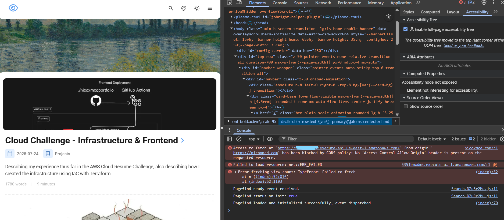

> You're experiencing this project right now: [Home](https://nicoxmcd.com)

:::note[The Goal]
The main idea behind this section of the Cloud challenge was implementing a visitor counter using the API Gateway, Lamdbda, and DynamoDB.
:::

## Problems Solved

- CORS
- Initializing the first item in DynamoDB
- JSON formatting from Lambda (Outputs, decimals, etc.)
- API URL injection

## Infrastucture
Since the last past, I've added a couple more resources.

`api.tf` routes calls and specifies what's allowed, allowing the site to fetch from lambda. 
```hcl
resource "aws_apigatewayv2_api" "api" {
  name          = "nicoxmcdportfolio-api"
  protocol_type = "HTTP"
  
  cors_configuration {
    allow_origins     = ["*"]             
    allow_methods     = ["GET","OPTIONS"]
    allow_headers     = ["*"]   
    expose_headers    = []             
    allow_credentials = false    
    max_age           = 3600        
  }
}

resource "aws_lambda_permission" "api_invoke" {
  statement_id  = "AllowAPIGatewayInvoke"
  action        = "lambda:InvokeFunction"
  function_name = aws_lambda_function.view_counter.function_name
  principal     = "apigateway.amazonaws.com"
  source_arn    = "${aws_apigatewayv2_api.api.execution_arn}/*/*"
}

resource "aws_apigatewayv2_integration" "lambda_integration" {
  api_id           = aws_apigatewayv2_api.api.id
  integration_type = "AWS_PROXY"
  integration_uri  = aws_lambda_function.view_counter.invoke_arn
  integration_method = "POST"
  payload_format_version = "2.0"
}

resource "aws_apigatewayv2_route" "default_route" {
  api_id    = aws_apigatewayv2_api.api.id
  route_key = "GET /"
  target    = "integrations/${aws_apigatewayv2_integration.lambda_integration.id}"

}

resource "aws_apigatewayv2_stage" "default_stage" {
  api_id      = aws_apigatewayv2_api.api.id
  name        = "$default"
  auto_deploy = true
}
```

`db.tf` sets up the DynamoDB table with its attributes.
```hcl
resource "aws_dynamodb_table" "db" {
  name           = "nicoxmcdportfolio-views"
  billing_mode   = "PAY_PER_REQUEST"
  hash_key       = "ID"

  attribute {
    name = "ID"
    type = "S"
  }
  
  tags = {
    Project = var.domain_name
  }
}
```
### Another Problem Solved
Originally I had the initial item `nicoxmcdportfolio-views' set to 0.
```hcl
resource "aws_dynamodb_table_item" "initial_view_count" {
  table_name = aws_dynamodb_table.db.name
  hash_key   = "ID"
  item       = jsonencode({
    ID    = { S = "nicoxmcdportfolio" },
    views = { N = "0" }
  })
}
```
However, whenever I would make updates to the infrastructure, this number would reset to 0. *Which is not ideal.* So, I decided to make the initial value manually through the AWS CLI instead. 
```bash
aws dynamodb put-item \
  --table-name nicoxmcdportfolio-views \
  --item '{"ID": {"S": "nicoxmcdportfolio"}, "views": {"N": "0"}}'
```
That way, it's not stored in the Terraform state tf and therefore wouldn't be changed when updating the infrastructure. 

**Eventually**, I would like to make this an automated process. I want each blog post to have their own ID in the table, so I would need to make a script to do this.

`lambda.tf` also sets up a role that allows lambda to interact with DynamoDB, this is necessary because OIDC only provides permission for my GitHub repositories to interact with AWS resources. For those resources to interact *with each other* is a different story and needs its own role. 

I also zip the python script for updating the view counter, I found it easier to do it here, than in the workflow.
```hcl
resource "aws_iam_role" "lambda_exec_role" {
  name = "lambda_exec_role"

  assume_role_policy = jsonencode({
    Version = "2012-10-17",
    Statement = [{
      Action = "sts:AssumeRole",
      Effect = "Allow",
      Principal = {
        Service = "lambda.amazonaws.com"
      }
    }]
  })
}

data "archive_file" "lambda" {
  type        = "zip"
  source_file = "view-counter.py"
  output_path = "view-counter.zip"
}

resource "aws_iam_role_policy_attachment" "lambda_dynamodb_access" {
  role       = aws_iam_role.lambda_exec_role.name
  policy_arn = "arn:aws:iam::aws:policy/AmazonDynamoDBFullAccess"
}

resource "aws_lambda_function" "view_counter" {
  function_name = "nicoxmcdportfolio-view-counter"
  handler       = "view-counter.lambda_handler"
  runtime       = "python3.11"
  role          = aws_iam_role.lambda_exec_role.arn
  filename      = data.archive_file.lambda.output_path

  source_code_hash = data.archive_file.lambda.output_base64sha256

  environment {
    variables = {
      TABLE_NAME = aws_dynamodb_table.db.name
    }
  }
}
```
`view-counter.py` contains the functions code that gets uploaded to Lambda. The script grabs the views value from the ID `nicoxmcdportfolio` and increments it by one and stores the updated value back in the table. If this is successful, it returns a `StatusCode: 200` and the view count.

```python
import boto3
import json
import os

dynamodb = boto3.resource("dynamodb")
table = dynamodb.Table(os.environ["TABLE_NAME"])

def lambda_handler(event, context):
    # Retrieve the current visitor count
    item = table.get_item(Key={"ID":"nicoxmcdportfolio"})
    views = int(item["Item"]["views"])

    # Increment the visitor count
    views += 1

    # Update the DynamoDB table with the new count
    table.put_item(Item={"ID":"nicoxmcdportfolio", "views": views})

    return {
        "statusCode": 200,
        "headers": {
            "Content-Type": "application/json"
        },
        "body": json.dumps({"views": views})
    }
```


## Frontend
I decided to edit the `Home` button in the navigation bar to be the view-counter. I replaced the original icon and added a `<span id="view-counter"></span>` inside the original button. With the `view-counter` id, I can easily update the value to represent the number of views.
```html
<a href={url('/')} class="btn-plain scale-animation rounded-lg h-[3.25rem] px-5 font-bold active:scale-95"> <!-- home button that I wanna replace -->
    <div class="flex flex-row text-[var(--primary)] items-center text-md">
        <Icon name="fa6-regular:eye" class="text-[1.75rem] mb-1 mr-2" />
        <span id="view-counter"></span>
    </div>
</a>
```
This is the script for fetching the view count from AWS. It basically just gets the returned value from the python script.

```js
<script>
async function fetchViewCount() {
  try {
    const response = await fetch("__VIEW_COUNTER_URL__");
    const data = await response.json();

    const counter = document.getElementById("view-counter");
    if (counter) {
      counter.textContent = `${data.views}`;
    }
  } catch (e) {
    console.error("Error fetching view count:", e);
  }
}

if (document.readyState === "loading") {
  document.addEventListener("DOMContentLoaded", fetchViewCount);
} else {
  fetchViewCount();
}
</script>
```

### Some Solved Issues:
- Injecting the API URL so it would **not** be directly in my GitHub repository, to accomplish this, I added it as `API_URL` in GitHub secrets and referenced it when building the project in the deploy script.
```yml
- name: Add API URL
    run: |
      API_URL=${{ secrets.API_URL }}
      sed -i "s|__VIEW_COUNTER_URL__|$API_URL|g" src/components/Navbar.astro
```
- Object might be null error, to fix this I implemented a conditional therefore bypassing the error.
```yml
    const counter = document.getElementById("view-counter");
    if (counter) {
      counter.textContent = `${data.views}`;
    }
```

## Conclusion
So, the total rundown of this section is that I finally implemented the visitor counter! I successfully configured the API to communicate from the backend to the frontend. This is a great step forward and I'm excited for what's next.

## Reflection
I found the Javascript the toughest, Javascript is not my strong suit. I think another part that *still* frustrates me is that I haven't automated the initial item in the database yet, so I want to go back and fix that up. 

For this section, I really like the mod ideas, I want to add a portion to make sure the only unique visitors will be counted as a new visitor. I also noticed that when going to different pages, that because it using the navigation bar component, the visitor counter will update too. So if you explore the website after a while, you'll have contributed 10+ views. (*Thank you, but I should really fix that!*)

For the next portion of the challenge, I will move on to automated testing, afterwards I plan to add more of the mods. 

:::note[News]
I will also redo the entire challenge upon completion, because I am changing my name! So, I have to make sure that the infrastructure can be updated easily!
:::