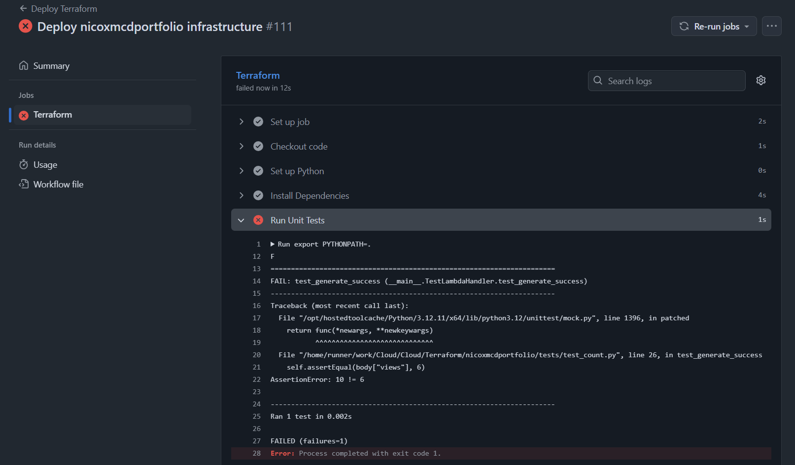
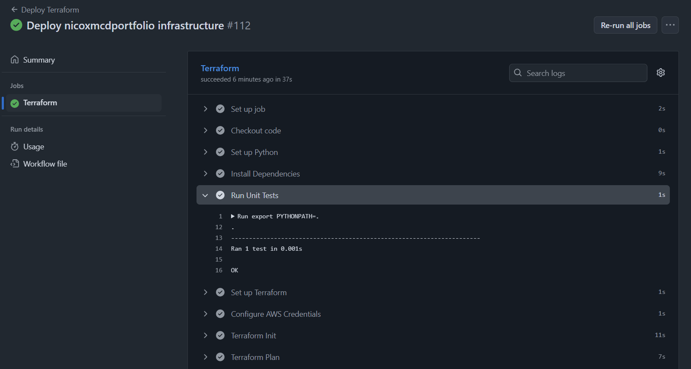
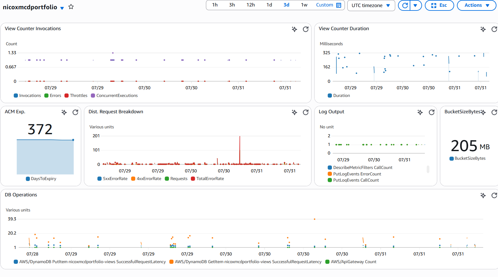
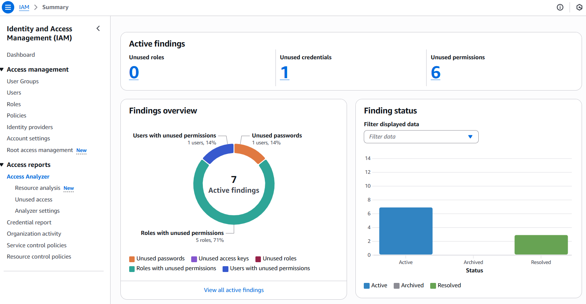

## Overview
This section covers the final stretch of the challenge, talking about how I implemented testing to the lambda function and the various mods implemented throughout the challenge. I wanted to do as many of them as I could to get some more skills under my belt and for a well-rounded experience. I really only completed four (*1 Dev, 1 Security, 2 DevOps*), but I think they were super fun to add onto the project. I also acknowledge that it's best to stick to one type of mod to specialize in a specific aspect. Feel free to share your thoughts, for this stage of my career I want to know a tiny bit of everything, and really be very detail oriented in 1 or 2 technologies. With AI on the rise, I believe it will be useful to know a bit of everything in order to partner with AI in future projects.

## Testing 
`view_counter.py` is the Lambda function I built in the previous section. I did make some minor adjustments like specifying the `region_name` for the `dynamodb` resource and instead of using a dynamic naming technique for the `dynamodb.Table`, I hard-coded it, since this is for this project anyhow. I came across long-winded errors from the Python Unittest without these things defined, so I figured this was the best way to mitigate them.
```python
dynamodb = boto3.resource("dynamodb", region_name='us-east-1')
table = dynamodb.Table("nicoxmcdportfolio-views")
```

`test_counter.py` is a test file in the `tests/` directory within the `nicoxmcdportfolio` section. This test is fairly simple since the lambda function itself it simple. The original lambda function should increment the view count by 1. In this test, I import the `view_counter.py` script as `vc` and patch the `dynamodb.Table`. From there we define a mock table with the views set to 5. Since there are only five views, it should return 6 after running the `view_counter.py`. If it returns 6 and `StatusCode = 200`, then it will return as a success. This logic will become more complex as I continue to add more to the lambda function. I plan to add some sort of way to count unique views only, so this might change the way the current test is working.
```python
import unittest
import json
from unittest.mock import patch, MagicMock
import sys
import os

# Ensure root directory is in path
sys.path.insert(0, os.path.abspath(os.path.join(os.path.dirname(__file__), '..')))

import view_counter as vc

class TestLambdaHandler(unittest.TestCase):

    @patch("view_counter.table")

    def test_generate_success(self, mock_table):
        mock_table.get_item.return_value = {"Item": {"views": 5}}

        event = {}

        response = vc.lambda_handler(event, None)
        body = json.loads(response["body"])

        self.assertEqual(response["statusCode"], 200)
        self.assertIn("views", body)
        self.assertEqual(body["views"], 6)


if __name__ == "__main__":
    unittest.main()
```

`requirements.txt` just states a specific dependency that needed to be installed, boto3 is Amazon's library for Lambda functions in Python.
```txt
boto3 == 1.39.15
```

This is just a snippet from the `terraform.yml`. This is where I added the python tests, I ran it quite early in the workflow, before initializing Terraform, this is so if the Lambda script is not working, Terraform won't bother attempting any changes. This is also to minimize runner time in case of error to reduce cost (which is essentially nothing, but the mindset is good).
```yml
    - name: Checkout code
      uses: actions/checkout@v4

    - name: Set up Python
      uses: actions/setup-python@v4
      with:
        python-version: '3.12'
    
    - name: Install Dependencies
      run: |
        python -m pip install --upgrade pip
        pip install -r requirements.txt
    
    - name: Run Unit Tests
      run: |
        export PYTHONPATH=.
        python tests/test_count.py
```

If the lambda script is not behaving as expected, it will stop the workflow immediately, even before Terraform is initialized.


If the lambda script is behaving as expected, it will continue onto to the end of the workflow, either to Terraform plan or deploying the infrastructure depending on user input.


## Mods Throughout The Challenge
These are the mods I added with their associated explanations of where or how I implemented them.
- **Building the Frontend**
    - *Developer Mod: Frame Job*
        - I hear you saying. *But Nicole, you used a template, why would you count it as completing the mod?* And what I have to say to that is, figuring out a complex template like Fuwari is a feat in and of itself. I did add a lot of my own pages and learned to customize the original setup. And how to navigate errors because of Astro or Typescript. So just working with these frameworks was pretty cool. So yes, I'm giving myself credit for figuring it out. 
    - *DevOps Mod: Automation Nation*
        - I jumped straight into IaC, building only with Terraform because I already knew how powerful it would be. Plus, I agree that clicking around in AWS is pretty tiring, it's much better to automate it.
        - I also included a workflow to build the frontend and upload it to S3, so that's two whole workflows! 

- **Building the API**
    - *DevOps Mod: Monitor Lizard*
        - Monitoring is super important in DevOps, it keeps us proactive, being able to catch small changes in how services are being used, or being able to quickly react to various situations.
        - Here is the CloudWatch dashboard I put together that monitors the Lambda function invocations, deployments, and item updates to the DynamoDB table:
        
        - **Fun Fact**: My fiance and I have 4 lizards!
        
    - *Security Mod: Check yo Privilege*
        - Used [IAM Access Analyzer](https://docs.aws.amazon.com/IAM/latest/UserGuide/what-is-access-analyzer.html#what-is-access-analyzer-resource-identification) to analyze organization wide unused permissions.
        - This is to use the principle of least privilege, basically only providing exactly the permissions needed to complete the job.
        - This was the IAM access analyzer before implementing changes:
        

## What's Next?
After completing the challenge, I think getting more exposure into using all of the services together and how services interact with each other would be a next step. I plan to complete another certification: Developer (mostly because AWS has announced they will update the SysOps Admin to CloudOps in September), then I plan to achieve the CloudOps certification. 

At the same time I want to complete more hands-on labs or build fun things for my friends. Basically getting more technical experience. As I was reading the Challenge book, I was really inspired by the advice in the final section:

> *Read the documentation*

Because I'm most familiar with GitHub Actions, I do want to go through the documentation and try to learn new ways to utilize that tool. Possibly leveraging GitHub's built-in monitoring. And then probably Terraform, because Terraform was the most challenging for me (mostly since I decided to build it using IaC right away.)

## Resources
Feel free to check out the source code for both the cloud infrastructure and portfolio source code.

::github{repo="nicoxmcd/nicoxmcdportfolio"}

::github{repo="nicoxmcd/cloud"}

:::note[Reflection]
This challenge has been super fun to do, although very challenging. Completing the full challenge gives a good idea on how to build and ship a final customer-facing product in AWS. Also! I do want to complete more mods for the challenge and making this a proper robust portfolio and I feel like the challenge was a fantastic way to gain experience building with AWS.
:::