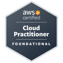

:::tip[[Certifications](https://www.credly.com/badges/e7d906e6-75b4-4b7c-8f1d-41f9d9e4c913/public_url)]

:::

:::tip[Skills]
- **AWS Cloud**: IAM, EC2, S3, CloudWatch, Certificate Manager, Amplify, Auto Scaling, Elastic Load Balancing, DynamoDB, Route53, CloudFront, IAM Identity Center
- **DevOps**: Git, GitHub Actions, JFrog Artifactory, Docker, Snyk, Jenkins, Terraform
- **Programming**: Python, Bash, YAML, JSON, C++, Java, REST APIs
- **OS**: Windows, Linux, Ubuntu, RHEL8
- **Productivity**: Microsoft Office, Google Workspace, Notion, Confluence, Jira, Canva
- **Languages**: English (Native), Spanish (Conversational), German, Korean (Beginner)

:::

:::note
I regularly go back and practice key skills in different programming languages and review previous work, feel free to look through them here
:::
::github{repo="nicoxmcd/Practice"}

